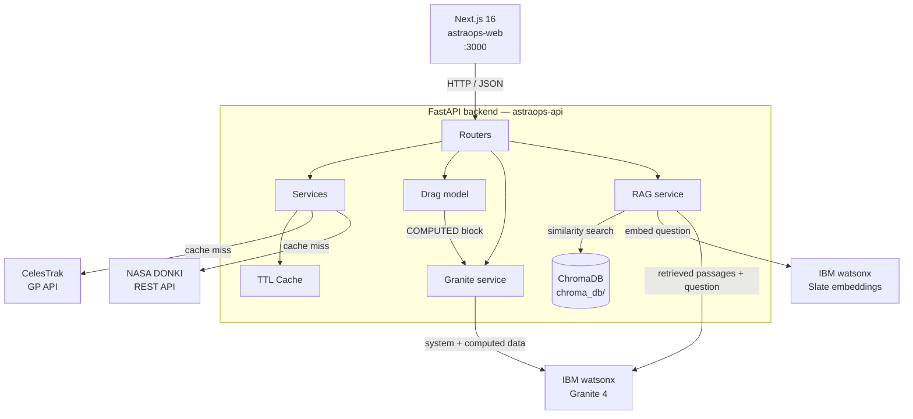

# AstraOps — Mission Intelligence Platform

Live orbital and heliophysics data, screened and interpreted.

---

## The problem

Public space data is published raw and never translated into operator-facing decisions.

NOAA issues real-time alerts for solar flares, CMEs, and geomagnetic storms, but those alerts were calibrated for ground infrastructure — power grids and HF radio — not for spacecraft in orbit. Fang et al. (2022) in *Space Weather* documented that NOAA issues no drag-focused alerts for satellite operators despite publishing all the underlying event data. The G-scale, which runs from G1 (minor) to G5 (extreme), says nothing about thermospheric density at 200 km.

In February 2022 a geomagnetic storm rated G1 — the mildest category — raised atmospheric density at ~210 km by roughly 50%, increasing drag on newly launched Starlink satellites beyond what their propulsion systems could recover from. Thirty-eight of forty-nine vehicles re-entered. The number said "minor"; the outcome was a total loss. See [docs/RESEARCH.md](docs/RESEARCH.md) for full sources.

---

## The solution

AstraOps reads the same feeds and closes the interpretation gap. The architecture has three layers:

1. **Ingest** — pull live data from CelesTrak (TLE orbital elements) and NASA DONKI (solar event catalogue), with an in-memory TTL cache and a disk-backed fallback so a cold start after a host sleep does not blank the UI.

2. **Compute** — run deterministic orbital mechanics. SGP4 propagates every satellite forward in time; pairwise conjunction screening finds close approaches and refines the time of closest approach to one-second resolution; collision probability is estimated from a closed-form isotropic covariance model.

3. **Interpret** — hand the computed results to IBM Granite on watsonx. **The language model never performs arithmetic.** Every number on screen — miss distance, relative velocity, Kp index, flare class — comes from orbital mechanics or a published feed. Granite only explains what those numbers mean for an operator: which subsystems are at risk, what to do, and by when.

---

## Features

- **Live TLE tracking** — fetches element sets from the CelesTrak GP API for any named group (Starlink, stations, active catalogue, etc.), parses them into structured records with inclination, eccentricity, mean motion, and estimated altitude, and serves a 3D globe with positions propagated to the current second and refreshed every 15 seconds.

- **SGP4 conjunction screening** — propagates every satellite pair across a three-hour window on a 30-second grid, records the running minimum separation, then re-propagates flagged pairs at one-second resolution to pin down the exact time of closest approach (TCA) and miss distance. Relative velocity is computed alongside range. Collision probability uses a closed-form isotropic-covariance formula (200 m 1-sigma, 20 m combined hard-body radius).

- **NASA DONKI space weather monitoring** — proxies the DONKI REST API for solar flares (class, peak time, active region), coronal mass ejections (speed, source location), and geomagnetic storms (Kp-max). Results are cached for 15 minutes.

- **Deterministic drag-decay model** — `services/drag.py` computes, from live DONKI data alone: CME Sun-Earth transit time and estimated arrival UTC; forecast Kp derived from CME speed (or observed Kp when a storm is recorded); thermospheric density enhancement (1 + 0.10 × Kp); and 72-hour altitude loss at 210, 400, and 550 km for a 3U CubeSat (Cd 2.2, A/m 0.01 m²/kg). These figures are passed to Granite as a labelled `COMPUTED` block — Granite cites them, it does not generate them. The space weather brief response carries a `computed` field containing the raw numbers, which the frontend displays in a separate panel beside the AI narrative.

- **Operational posture** — `GET /briefs/posture` fetches the current satellite count, runs conjunction screening, and reads seven days of space weather, then asks Granite to synthesise all three into a one-line status: `NOMINAL`, `ELEVATED`, or `ACTION REQUIRED`, with one sentence of justification. `ACTION REQUIRED` fires only if a conjunction is under 5 km or observed Kp ≥ 6; `ELEVATED` covers M/X-class flares, CMEs, fast conjunctions, or moderate Kp. The result is shown at the top of the dashboard.

- **Co-located cluster collapse** — docked modules (CSS Tianhe/Wentian/Mengtian, ISS and its visiting vehicles) each appear as a separate TLE object, so a single external encounter produces one row per docked module with identical geometry. `_collapse_colocated` in `services/conjunctions.py` groups rows by (TCA, miss distance, relative velocity), identifies the one object common to every row in a group, and merges the cluster into a single event labelled `+N co-located` — so one conjunction remains one row in the table.

- **Granite-generated operational briefs** — `GET /briefs/spaceweather` and `GET /briefs/conjunction` call IBM Granite 4 on watsonx with structured system prompts that enforce orbit-regime separation, prohibit invented figures, and require IMPACT / SUBSYSTEMS / ACTION / CONFIDENCE sections. Rate-limit errors (429) are caught and retried with exponential back-off.

- **RAG research copilot** — PDF and text documents placed in `corpus/` are chunked at 800 characters (100-character overlap), embedded with IBM's `slate-125m-english-rtrvr-v2` model, and stored in a persistent ChromaDB collection. Questions are embedded the same way; the nearest passages are retrieved and given to Granite, which is instructed to cite filenames and say it does not know rather than invent.

- **3D orbital visualisation** — `react-globe.gl` renders each satellite as a coloured sphere at its current geodetic position. Altitude is compressed logarithmically (base 10) so LEO and GEO objects are both legible on one globe; at true scale, GEO would sit five Earth-radii off the screen.

---

## Architecture



---

## Tech stack

| Layer | Technology |
|---|---|
| Frontend | Next.js 16, React 19, TypeScript, Tailwind CSS 4 |
| 3D globe | `react-globe.gl`, Three.js |
| Charts | Recharts |
| Backend | FastAPI 0.111, Python 3.13, uvicorn |
| Orbital mechanics | `sgp4` (Vallado SGP4/SDP4), NumPy |
| HTTP client | `httpx` (async) |
| AI / LLM | IBM Granite 4 (`ibm/granite-4-h-small`) via `langchain-ibm` |
| Embeddings | IBM Slate 125M (`ibm/slate-125m-english-rtrvr-v2`) |
| Vector store | ChromaDB (persistent, local) |
| Document loading | `langchain-community` (PyPDFLoader, TextLoader) |
| Config | `pydantic-settings`, `python-dotenv` |
| Testing | pytest, pytest-asyncio, httpx MockTransport |
| Deployment | Render (backend, Docker), Vercel (frontend) |

---

## Setup

### Backend — `astraops-api`

**Requirements:** Python 3.13, a NASA API key, IBM Cloud credentials with a Watsonx project.

```bash
cd astraops-api

python3.13 -m venv .venv
source .venv/bin/activate

pip install -r requirements.txt

cp .env.example .env
# Fill in the values below
```

#### Environment variables

| Variable | Required | Default | Description |
|---|---|---|---|
| `NASA_API_KEY` | yes | `DEMO_KEY` | Free key from [api.nasa.gov](https://api.nasa.gov) — `DEMO_KEY` is limited to 30 req/hr |
| `WATSONX_APIKEY` | yes (AI features) | `""` | IBM Cloud API key |
| `WATSONX_PROJECT_ID` | yes (AI features) | `""` | Watsonx project ID |
| `WATSONX_URL` | yes (AI features) | `https://us-south.ml.cloud.ibm.com` | Watsonx regional endpoint |
| `CORS_ORIGINS` | yes (production) | `["http://localhost:3000"]` | JSON array of allowed frontend origins |
| `DEBUG` | no | `false` | Verbose logging |
| `TLE_CACHE_TTL` | no | `14400` | TLE cache lifetime (seconds) |
| `SPACEWEATHER_CACHE_TTL` | no | `900` | Space weather cache lifetime (seconds) |
| `CONJUNCTION_CACHE_TTL` | no | `1800` | Conjunction result cache lifetime (seconds) |

```bash
# Start the development server
uvicorn main:app --reload --port 8000
# Swagger UI: http://localhost:8000/docs
```

To enable the RAG copilot, place PDF or `.txt` files in `astraops-api/corpus/`. The index is built automatically on the first `POST /research/ask` request and persisted to `chroma_db/`.

### Frontend — `astraops-web`

**Requirements:** Node.js 20+.

```bash
cd astraops-web
npm ci

# Create a .env.local file:
echo "NEXT_PUBLIC_API_URL=http://localhost:8000" > .env.local

npm run dev
# http://localhost:3000
```

---

## Testing

The project has **136 passing tests** — **84 backend** covering TLE parsing, the CelesTrak stale-notice fallback path, SGP4 conjunction screening edge cases, the DONKI proxy error handler, and the TTL cache. All external HTTP calls are stubbed with `httpx.MockTransport` — no test touches the network.

The frontend has **52 tests** under Vitest with React Testing Library, covering the API
client's error handling, all four pages, and the separation chart's velocity-regime
classification. `next/dynamic` and `react-globe.gl` are stubbed so the WebGL globe does not
need to render in jsdom.

```bash
cd astraops-api
source .venv/bin/activate
pytest
```

```
84 passed in 0.17s
```

---

## Tooling

[LangChain](https://github.com/langchain-ai/langchain) (`langchain-ibm`, `langchain-core`) orchestrates all model calls in the backend — the Granite briefing layer uses `ChatWatsonx` with `SystemMessage` / `HumanMessage` pairs, and the RAG pipeline is built from LangChain components throughout — `PyPDFLoader` and `TextLoader` for ingestion, `RecursiveCharacterTextSplitter` for chunking, `WatsonxEmbeddings` for vectorisation, and `langchain-chroma` for the persistent store and similarity search.

[Langflow](https://github.com/langflow-ai/langflow) was used separately as a visual prototyping environment to design and validate a Mission Planner agent against the AstraOps API using the same Granite model. It is a development tool, not a runtime dependency of the application.

---

## Built with IBM Bob

Bob (IBM's AI software engineer) scaffolded the FastAPI backend from scratch, including the project structure, Pydantic models, pydantic-settings config, CORS middleware, and all five routers. Bob implemented the full RAG retrieval pipeline in `services/research.py` — corpus loading, chunking, Watsonx embedding, ChromaDB indexing, similarity search, and Granite generation with graceful fallbacks at every failure point. Bob generated the 84-test pytest suite, designing the `httpx.MockTransport` stubbing strategy that keeps every test hermetic and the full suite under 200ms.

The orbital mechanics (`services/conjunctions.py` — SGP4 propagation, TCA refinement, collision probability), the Granite briefing layer (`services/granite.py` — system-prompt engineering, retry logic, orbit-regime separation rules), and the Next.js frontend were built on that foundation.

---

## Known limitations

| Limitation | Detail |
|---|---|
| **150-object conjunction cap** | Pairwise screening is O(n²) in the number of satellites × time steps. The service caps the screened population at 150 objects (`MAX_SATELLITES`). The full active catalogue (~25 000 objects) requires a spatial index (e.g. bounding-volume hierarchy or conjunction filter) that is outside the scope of this project. |
| **Isotropic covariance in collision probability** | Pc is estimated with a closed-form formula that assumes a combined 200 m 1-sigma spherical position uncertainty and a 20 m combined hard-body radius. Real operator covariances are asymmetric, epoch-dependent, and manoeuvre-correlated. The screening Pc is a first-order indicator, not an operator-grade value. |
| **Spherical Earth for display positions** | `services/satellites.py` converts TEME coordinates to geodetic using a spherical Earth model (R = 6371 km). The resulting latitude and longitude carry sub-degree error relative to a WGS-84 oblate ellipsoid, which is acceptable for visualisation but not for precision operations. |
| **CelesTrak two-hour refresh window** | CelesTrak updates its GP catalogue approximately every two hours. When the upstream dataset has not changed since the last request, CelesTrak returns a plain-text notice rather than TLE data. The service detects this notice, returns the last known-good set from a 24-hour stale cache, and logs an info message. A fresh set is not available until CelesTrak publishes it. |

---

## Sources

See [docs/RESEARCH.md](docs/RESEARCH.md) for the primary literature referenced in this project, including Fang et al. (2022) on the thermospheric density response to the February 2022 storm and the Starlink loss-of-mission report.
